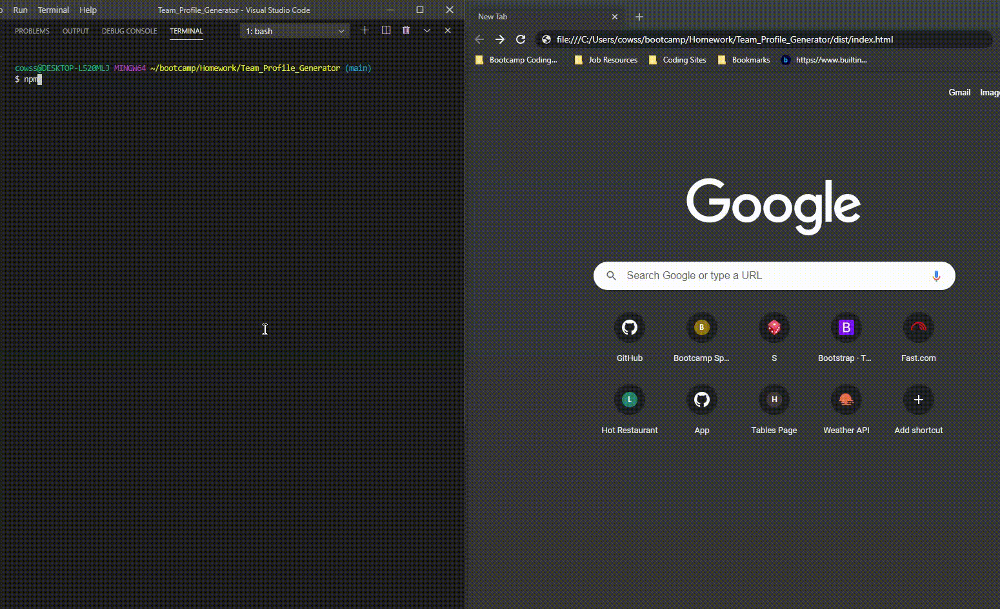
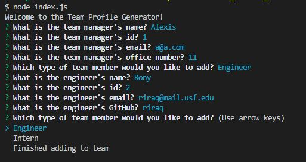
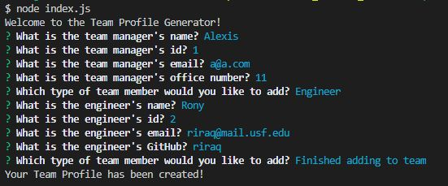
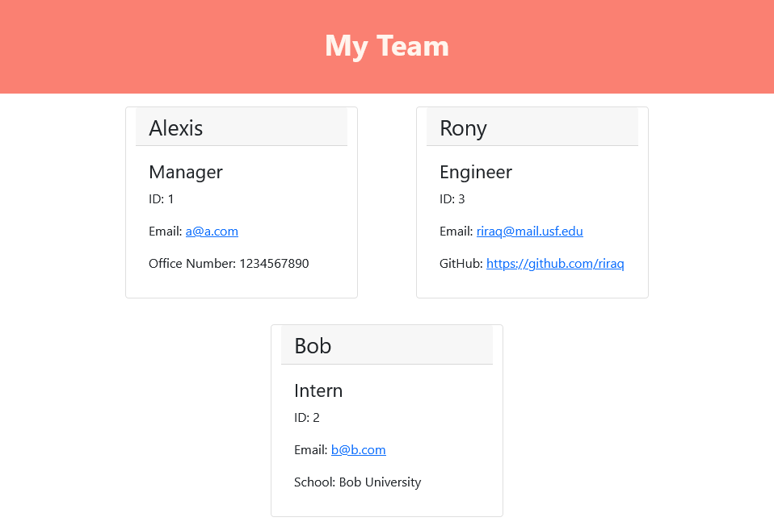

# Team_Profile_Generator
An application that produces an HTML document that displays a summary of a software engineering team.

## Code Description
App that generates a team profile html file that uses Node.js, with the Inquirer package using several prompts for user input. The HTML is generated using JavaScript which will create cards for each team member. Based on the number of team members, the appropriate number of cards will be added to the HTML using templates based on the position of the member. Bootstrap is used to style most of the app, but some other styles were adding using a CSS file.
## Installation
1. Clone the repository from https://github.com/riraq/Team_Profile_Generator.
2. Run "npm i" in the main directory of the application in order to install dependencies (Inquirer).
3. In order to run the tests, Jest must be installed.
## Tests
Four tests are provided for each of the classes of employee. In order to run it, Jest is needed and can be done from the command console while using Node.js. 
## Function
The application functions by running index.js in the command line. This brings up several prompts for the user to answer, with all of them being free text inputs. The first set of prompts sets up the manager for the team and then a choice is provided at the end to allow an engineer, intern or finish adding to team. If an engineer or intern is added, more prompts are provided in order to generate that team member. If finish adding to team is chosen, then the application ends and generates the HTML file based on the user inputs into the dist folder. When the file is opened in a web browser, a styled page is displayed with the team.
## Video Demo
### Walkthrough

Direct Link - https://github.com/riraq/Team_Profile_Generator/blob/main/assets/walkthrough.gif
## Screenshots
### User Input 

### Finished Prompt

### Final HTML

